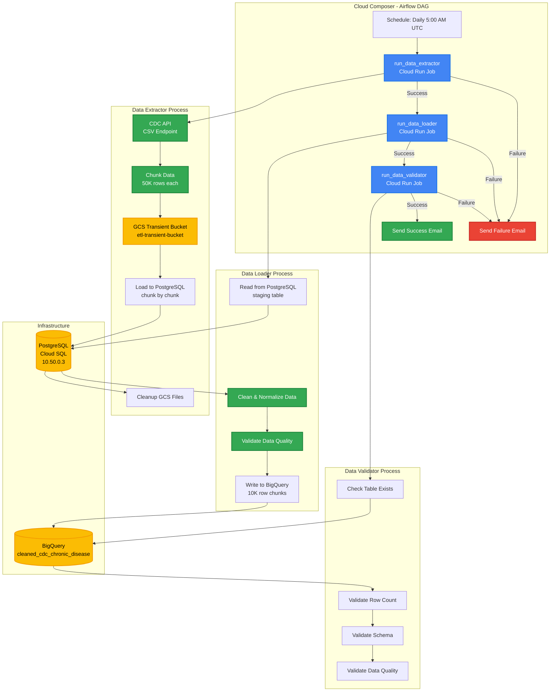
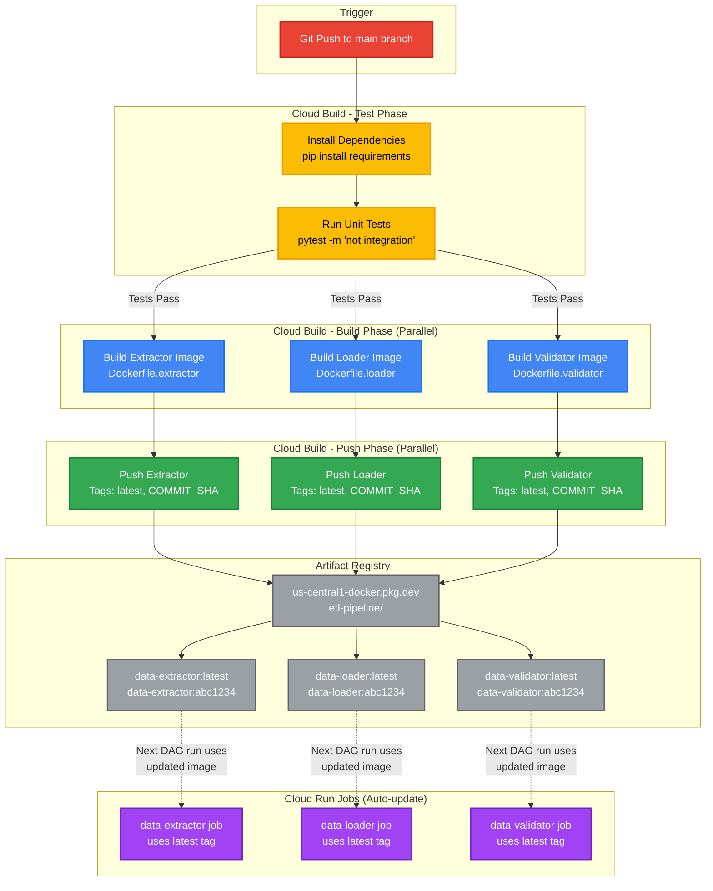

# GCP ETL Pipeline - Architecture Diagrams

## 1. Runtime ETL Pipeline (Daily Execution)

This diagram shows the daily ETL workflow orchestrated by Cloud Composer (Airflow).



---

## 2. CI/CD Build Pipeline

This diagram shows the automated build and deployment process triggered on code push.



---

## Pipeline Flow Summary

### Runtime Flow (ETL Execution)
1. **Data Extractor** (Cloud Run Job)
   - Extracts data from CDC API
   - Chunks data into 50K row segments
   - Saves chunks to GCS transient bucket
   - Loads chunks into PostgreSQL staging table
   - Cleans up GCS files

2. **Data Loader** (Cloud Run Job)
   - Reads data from PostgreSQL staging table
   - Cleans and normalizes data
   - Validates data quality
   - Loads data to BigQuery in 10K row chunks

3. **Data Validator** (Cloud Run Job)
   - Validates BigQuery table exists
   - Validates row count (min 100K rows)
   - Validates schema structure
   - Validates data quality metrics

4. **Email Alerts**
   - Success email: Sent when all tasks complete
   - Failure email: Sent if any task fails

### Build Flow (CI/CD)
1. **Test Phase**
   - Install Python dependencies
   - Run unit tests (excluding integration tests)
   - Generate coverage report

2. **Build Phase** (Parallel)
   - Build 3 Docker images simultaneously
   - Tag with commit SHA and 'latest'

3. **Push Phase** (Parallel)
   - Push all images to Artifact Registry
   - Multiple tags per image

4. **Auto-Update**
   - Cloud Run Jobs automatically use latest images
   - Next DAG run executes with updated code

---

## Key Components

| Component | Type | Purpose |
|-----------|------|---------|
| **Cloud Composer** | Orchestration | Schedules and manages DAG execution |
| **Cloud Run Jobs** | Compute | Executes containerized ETL tasks |
| **Cloud SQL (PostgreSQL)** | Database | Staging layer for data processing |
| **BigQuery** | Data Warehouse | Final analytics-ready data storage |
| **GCS** | Object Storage | Temporary storage for data chunks |
| **Artifact Registry** | Container Registry | Stores Docker images |
| **Cloud Build** | CI/CD | Automated testing and deployment |

---

## Data Flow

```
CDC API (CSV)
    ↓ (50K chunks)
GCS Transient Bucket
    ↓ (load chunk by chunk)
PostgreSQL (Cloud SQL)
    ↓ (clean, validate, 10K chunks)
BigQuery (Final Table)
    ↓ (quality validation)
Success/Failure Email Alert
```
